# ClawWork Architecture Documentation

> Last Updated: 2026-03-03

## System Overview

ClawWork is an institutional-grade automated trading system that combines multiple AI/ML trading bots with comprehensive risk management layers. The system supports both paper and live trading modes with Fyers broker integration.

---

## Architecture Diagram

```mermaid
flowchart TB
    %% ═══════════════════════════════════════════════════════════════
    %% LAYER 1: USER INTERFACES
    %% ═══════════════════════════════════════════════════════════════
    subgraph L1["🖥️ LAYER 1 - USER INTERFACES"]
        direction LR
        UI["<b>React Dashboard</b><br/>frontend/src/*.jsx<br/>• BotEnsemble.jsx<br/>• Dashboard.jsx<br/>• Leaderboard.jsx"]
        CLI_START["<b>start_dashboard.sh</b><br/>Starts all services:<br/>Auth → API → Frontend → Tunnel"]
        CLI_TEST["<b>run_test_agent.sh</b><br/>Agent simulation runner"]
        CMCLI["<b>ClawMode CLI</b><br/>clawmode_integration/cli.py<br/>Task classification"]
    end

    %% ═══════════════════════════════════════════════════════════════
    %% LAYER 2: API GATEWAY & ORCHESTRATION
    %% ═══════════════════════════════════════════════════════════════
    subgraph L2["⚡ LAYER 2 - API GATEWAY & ORCHESTRATION"]
        direction LR
        API["<b>FastAPI Server</b><br/>livebench/api/server.py<br/>REST + WebSocket endpoints"]
        WS["<b>WebSocket Manager</b><br/>/ws endpoint<br/>Real-time updates"]
        MAIN["<b>Simulation Entry</b><br/>livebench/main.py<br/>Agent runner"]
        AGENT["<b>LiveAgent</b><br/>livebench/agent/live_agent.py<br/>LLM-powered agent"]
    end

    %% ═══════════════════════════════════════════════════════════════
    %% LAYER 3A: TRADING DOMAIN
    %% ═══════════════════════════════════════════════════════════════
    subgraph L3A["📈 LAYER 3A - TRADING SYSTEM"]
        direction TB

        subgraph ENS_BOX["Ensemble Coordinator"]
            ENS["<b>EnsembleCoordinator</b><br/>livebench/bots/ensemble.py<br/>Multi-bot consensus engine"]
        end

        subgraph STRAT_BOTS["Strategy Bots (Signal Generators)"]
            direction LR
            TF["TrendFollower"]
            RH["ReversalHunter"]
            MS["MomentumScalper"]
            OI["OIAnalyst"]
            VT["VolatilityTrader"]
        end

        subgraph AI_BOTS["AI/ML Bots"]
            direction LR
            MLB["MLTradingBot<br/>ml_bot.py"]
            LLM["LLMTradingBot<br/>llm_trading_bot.py"]
            DL["DeepLearning<br/>deep_learning.py"]
        end

        subgraph RISK_LAYERS["Risk & Control Layers"]
            direction LR
            VETO["LLMVetoLayer<br/>llm_veto.py"]
            ARC["AdaptiveRiskController<br/>adaptive_risk_controller.py"]
            IRL["InstitutionalRiskLayer<br/>institutional_risk_layer.py"]
        end

        subgraph SUPPORT_BOTS["Support Systems"]
            direction LR
            RD["RegimeDetector"]
            MTF["MultiTimeframe"]
            PO["ParameterOptimizer"]
            CA["CapitalAllocator"]
            MDD["ModelDriftDetector"]
        end

        subgraph EXEC_BOX["Execution"]
            direction LR
            EE["ExecutionEngine<br/>execution_engine.py"]
            AT["<b>AutoTrader</b><br/>livebench/trading/auto_trader.py<br/>Paper/Live execution"]
        end
    end

    %% ═══════════════════════════════════════════════════════════════
    %% LAYER 3B: AGENT DOMAIN
    %% ═══════════════════════════════════════════════════════════════
    subgraph L3B["🤖 LAYER 3B - AGENT SYSTEM"]
        direction TB
        TM["<b>TaskManager</b><br/>livebench/work/task_manager.py"]
        ET["<b>EconomicTracker</b><br/>livebench/agent/economic_tracker.py"]
        DT["<b>DirectTools</b><br/>livebench/tools/direct_tools.py"]
        WE["<b>WorkEvaluator</b><br/>livebench/work/evaluator.py"]
        LLME["<b>LLMEvaluator</b><br/>livebench/work/llm_evaluator.py"]
    end

    %% ═══════════════════════════════════════════════════════════════
    %% LAYER 3C: INSTITUTIONAL VALIDATION
    %% ═══════════════════════════════════════════════════════════════
    subgraph L3C["🏛️ LAYER 3C - INSTITUTIONAL VALIDATION PHASES"]
        direction LR
        P1["<b>Phase 1</b><br/>Signal Engine<br/>Risk Metrics<br/>Threshold Sweep"]
        P2["<b>Phase 2</b><br/>Options Analyst<br/>Decision Layer<br/>Exit Gate"]
        P3["<b>Phase 3</b><br/>Multi-Agent<br/>Consensus<br/>Memory"]
        P4["<b>Phase 4</b><br/>Regime Model<br/>Position Sizer<br/>Portfolio Controls"]
        P5["<b>Phase 5</b><br/>Go-Live Gates<br/>Shadow Mode<br/>Feature Flags"]
        INT["<b>Integration</b><br/>Shadow Adapter<br/>Rollout Tracker<br/>Rollback Drills"]
    end

    %% ═══════════════════════════════════════════════════════════════
    %% LAYER 4: INFRASTRUCTURE & INTEGRATIONS
    %% ═══════════════════════════════════════════════════════════════
    subgraph L4["🔧 LAYER 4 - INFRASTRUCTURE & INTEGRATIONS"]
        direction TB

        subgraph FYERS_BOX["Fyers Broker Integration"]
            FY["<b>FyersClient</b><br/>fyers_client.py"]
            SCR["<b>Screener</b><br/>screener.py"]
            OAUTH["<b>OAuthHelper</b><br/>fyers_oauth_helper.py"]
            INST["<b>Institutional</b><br/>institutional.py"]
        end

        subgraph TOOLS_BOX["Productivity Tools"]
            SEARCH["search.py"]
            FILE_C["file_creation.py"]
            FILE_R["file_reading.py"]
            CODE["code_execution_sandbox.py"]
            VIDEO["video_creation.py"]
        end

        subgraph CLAWMODE_BOX["ClawMode Integration"]
            NANO["<b>Nanobot AgentLoop</b><br/>agent_loop.py"]
            TP["<b>TrackedProvider</b><br/>provider_wrapper.py"]
            CMTOOLS["<b>ClawMode Tools</b><br/>tools.py"]
            CLS["<b>TaskClassifier</b><br/>task_classifier.py"]
        end

        subgraph INFRA_BOX["External Services"]
            OPENAI["LLM APIs<br/>GPT-4o / GPT-4o-mini"]
            FS[("JSONL Storage<br/>livebench/data/")]
            TUN["Cloudflare Tunnel<br/>trading.bhoomidaksh.xyz"]
        end
    end

    %% ═══════════════════════════════════════════════════════════════
    %% FLOW CONNECTIONS
    %% ═══════════════════════════════════════════════════════════════

    %% Layer 1 → Layer 2
    UI -->|"HTTP/REST"| API
    UI -->|"WebSocket"| WS
    CLI_START -->|"spawns"| API
    CLI_START -->|"spawns"| UI
    CLI_START -->|"spawns"| TUN
    CLI_TEST -->|"runs"| MAIN
    CMCLI -->|"creates"| NANO

    %% Layer 2 Internal
    API <-->|"bidirectional"| WS
    MAIN -->|"initializes"| AGENT

    %% Layer 2 → Layer 3A (Trading)
    API -->|"start/stop/status"| AT
    API -->|"get signals"| ENS

    %% Layer 2 → Layer 3B (Agent)
    AGENT -->|"assigns work"| TM
    AGENT -->|"tracks costs"| ET
    AGENT -->|"uses"| DT

    %% Layer 3A Internal (Trading Flow)
    ENS -->|"collects signals"| STRAT_BOTS
    ENS -->|"ML predictions"| AI_BOTS
    ENS -->|"regime info"| SUPPORT_BOTS
    STRAT_BOTS -->|"raw signals"| VETO
    AI_BOTS -->|"AI signals"| VETO
    VETO -->|"approved signals"| ARC
    ARC -->|"risk-adjusted"| IRL
    IRL -->|"institutional filter"| EE
    EE -->|"optimized order"| AT

    %% Layer 3B Internal (Agent Flow)
    DT -->|"submits"| WE
    WE -->|"evaluates via"| LLME
    TM -->|"persists"| FS

    %% Layer 3C (Validation Pipeline)
    P1 -->|"signals"| P2
    P2 -->|"decisions"| P3
    P3 -->|"consensus"| P4
    P4 -->|"sized"| P5
    P5 -->|"approved"| INT
    INT -.->|"validates"| ENS

    %% Layer 3 → Layer 4
    AT -->|"places orders"| FY
    AT -->|"gets quotes"| SCR
    FY -->|"OAuth2"| OAUTH
    FY -->|"institutional rules"| INST
    DT -->|"uses"| TOOLS_BOX
    LLME -->|"calls"| OPENAI
    AGENT -->|"calls"| OPENAI
    ENS -->|"LLM veto"| OPENAI
    NANO -->|"wraps"| TP
    NANO -->|"uses"| CMTOOLS
    CMCLI -->|"classifies"| CLS
    TP -->|"tracks"| ET

    %% Storage connections
    ET -->|"saves"| FS
    WE -->|"saves"| FS
    ENS -->|"saves state"| FS
    AT -->|"saves trades"| FS

    %% Styling
    classDef interface fill:#e1f5fe,stroke:#01579b,stroke-width:2px
    classDef api fill:#fff3e0,stroke:#e65100,stroke-width:2px
    classDef trading fill:#e8f5e9,stroke:#2e7d32,stroke-width:2px
    classDef agent fill:#f3e5f5,stroke:#7b1fa2,stroke-width:2px
    classDef infra fill:#fce4ec,stroke:#c2185b,stroke-width:2px
    classDef institutional fill:#fff8e1,stroke:#f57f17,stroke-width:2px

    class UI,CLI_START,CLI_TEST,CMCLI interface
    class API,WS,MAIN,AGENT api
    class ENS,AT,EE,TF,RH,MS,OI,VT,MLB,LLM,DL,VETO,ARC,IRL,RD,MTF,PO,CA,MDD trading
    class TM,ET,DT,WE,LLME agent
    class FY,SCR,OAUTH,INST,OPENAI,FS,TUN,NANO,TP,CMTOOLS,CLS,SEARCH,FILE_C,FILE_R,CODE,VIDEO infra
    class P1,P2,P3,P4,P5,INT institutional
```



---

## ASCII Architecture Overview

```
┌─────────────────────────────────────────────────────────────────────────────┐
│                         USER INTERFACES (Layer 1)                           │
│  ┌──────────────┐  ┌────────────────┐  ┌─────────────┐  ┌────────────────┐  │
│  │React Dashboard│ │start_dashboard │  │run_test_    │  │ClawMode CLI    │  │
│  │ /dashboard   │  │    .sh         │  │  agent.sh   │  │                │  │
│  └──────┬───────┘  └───────┬────────┘  └──────┬──────┘  └───────┬────────┘  │
└─────────┼──────────────────┼──────────────────┼─────────────────┼───────────┘
          │ HTTP/WS          │ spawns           │ runs            │ creates
          ▼                  ▼                  ▼                 ▼
┌─────────────────────────────────────────────────────────────────────────────┐
│                      API GATEWAY (Layer 2)                                  │
│  ┌───────────────────────┐     ┌──────────────────────────────────────┐     │
│  │ FastAPI + WebSocket   │────▶│ LiveAgent (simulation) / MAIN        │     │
│  │ Port 8001             │     │                                      │     │
│  └───────────┬───────────┘     └──────────────────┬───────────────────┘     │
└──────────────┼──────────────────────────────────────┼───────────────────────┘
               │                                      │
     ┌─────────┴─────────┐                  ┌─────────┴─────────┐
     ▼                   ▼                  ▼                   ▼
┌────────────────────────────────────┐ ┌────────────────────────────────────┐
│    TRADING SYSTEM (Layer 3A)       │ │     AGENT SYSTEM (Layer 3B)        │
│                                    │ │                                    │
│  ┌──────────────────────────────┐  │ │  TaskManager ◀──▶ EconomicTracker  │
│  │    ENSEMBLE COORDINATOR      │  │ │        │                │          │
│  │  (Multi-bot consensus)       │  │ │        ▼                ▼          │
│  └──────────────┬───────────────┘  │ │   DirectTools ──▶ WorkEvaluator    │
│                 │                  │ │                        │           │
│    ┌────────────┼────────────┐     │ │                        ▼           │
│    ▼            ▼            ▼     │ │                  LLMEvaluator      │
│ ┌──────┐  ┌──────────┐  ┌──────┐   │ └────────────────────────────────────┘
│ │STRAT │  │  AI/ML   │  │SUPPORT│  │
│ │BOTS  │  │  BOTS    │  │SYSTEMS│  │ ┌────────────────────────────────────┐
│ │ x5   │  │  x3      │  │  x5   │  │ │  INSTITUTIONAL PHASES (Layer 3C)   │
│ └──┬───┘  └────┬─────┘  └───────┘  │ │                                    │
│    │           │                   │ │  P1 ──▶ P2 ──▶ P3 ──▶ P4 ──▶ P5    │
│    └─────┬─────┘                   │ │  Signal  Options Multi  Position   │
│          ▼                         │ │  Engine  Analyst Agent  Sizer      │
│  ┌───────────────────────────────┐ │ │              │                     │
│  │      RISK LAYERS              │ │ │              ▼                     │
│  │  LLMVeto → AdaptiveRisk →     │ │ │       Integration                  │
│  │  InstitutionalRisk            │ │ │  (Shadow/Rollout/Rollback)         │
│  └──────────────┬────────────────┘ │ └────────────────────────────────────┘
│                 ▼                  │
│  ┌───────────────────────────────┐ │
│  │  ExecutionEngine → AutoTrader │ │
│  │  (Paper/Live mode toggle)     │ │
│  └──────────────┬────────────────┘ │
└─────────────────┼──────────────────┘
                  │ places orders
                  ▼
┌─────────────────────────────────────────────────────────────────────────────┐
│                     INFRASTRUCTURE (Layer 4)                                │
│                                                                             │
│  ┌─────────────────┐  ┌─────────────────┐  ┌─────────────────────────────┐  │
│  │ FYERS BROKER    │  │ LLM PROVIDERS   │  │ STORAGE & TUNNEL            │  │
│  │ • FyersClient   │  │ • GPT-4o        │  │ • JSONL files                │  │
│  │ • Screener      │  │ • GPT-4o-mini   │  │ • Cloudflare Tunnel          │  │
│  │ • OAuth Helper  │  │                 │  │ • trading.bhoomidaksh.xyz   │  │
│  │ • Institutional │  │                 │  │                             │  │
│  └─────────────────┘  └─────────────────┘  └─────────────────────────────┘  │
│                                                                             │
│  ┌─────────────────────────────────┐  ┌─────────────────────────────────┐   │
│  │ PRODUCTIVITY TOOLS              │  │ CLAWMODE INTEGRATION            │   │
│  │ search, file_creation,           │  │ Nanobot AgentLoop,              │   │
│  │ file_reading, code_execution,    │  │ TrackedProvider, TaskClassifier  │   │
│  │ video_creation                  │  │                                 │   │
│  └─────────────────────────────────┘  └─────────────────────────────────┘   │
└─────────────────────────────────────────────────────────────────────────────┘
```

---

## Layer Details

### Layer 1: User Interfaces

| Component | File Path | Description |
|-----------|-----------|-------------|
| React Dashboard | `frontend/src/*.jsx` | Web UI for monitoring and control |
| start_dashboard.sh | `./start_dashboard.sh` | Starts Auth → API → Frontend → Tunnel |
| run_test_agent.sh | `./run_test_agent.sh` | Runs agent simulations |
| ClawMode CLI | `clawmode_integration/cli.py` | Task classification interface |

### Layer 2: API Gateway & Orchestration

| Component | File Path | Description |
|-----------|-----------|-------------|
| FastAPI Server | `livebench/api/server.py` | REST + WebSocket endpoints (port 8001) |
| WebSocket Manager | `/ws` endpoint | Real-time updates to frontend |
| Simulation Entry | `livebench/main.py` | Agent runner entry point |
| LiveAgent | `livebench/agent/live_agent.py` | LLM-powered autonomous agent |

### Layer 3A: Trading System

#### Ensemble Coordinator
| Component | File Path | Description |
|-----------|-----------|-------------|
| EnsembleCoordinator | `livebench/bots/ensemble.py` | Multi-bot consensus engine |

#### Strategy Bots (5 bots)
| Bot | File | Strategy |
|-----|------|----------|
| TrendFollower | `trend_follower.py` | Follows established trends |
| ReversalHunter | `reversal_hunter.py` | Identifies trend reversals |
| MomentumScalper | `momentum_scalper.py` | Quick momentum trades |
| OIAnalyst | `oi_analyst.py` | Open Interest analysis |
| VolatilityTrader | `volatility_trader.py` | Volatility-based signals |

#### AI/ML Bots (3 bots)
| Bot | File | Technology |
|-----|------|------------|
| MLTradingBot | `ml_bot.py` | Machine learning predictions |
| LLMTradingBot | `llm_trading_bot.py` | GPT-powered reasoning |
| DeepLearning | `deep_learning.py` | Neural network patterns |

#### Risk & Control Layers (3 layers)
| Layer | File | Purpose |
|-------|------|---------|
| LLMVetoLayer | `llm_veto.py` | AI review before execution |
| AdaptiveRiskController | `adaptive_risk_controller.py` | Dynamic risk adjustment |
| InstitutionalRiskLayer | `institutional_risk_layer.py` | Institutional rules enforcement |

#### Support Systems (5 systems)
| System | File | Function |
|--------|------|----------|
| RegimeDetector | `regime_detector.py` | Market regime identification |
| MultiTimeframe | `multi_timeframe.py` | Multi-TF alignment |
| ParameterOptimizer | `parameter_optimizer.py` | Auto-tuning parameters |
| CapitalAllocator | `capital_allocator.py` | Position sizing |
| ModelDriftDetector | `model_drift_detector.py` | Model health monitoring |

#### Execution
| Component | File | Description |
|-----------|------|-------------|
| ExecutionEngine | `execution_engine.py` | Order optimization |
| AutoTrader | `livebench/trading/auto_trader.py` | Paper/Live execution |

### Layer 3B: Agent System

| Component | File Path | Description |
|-----------|-----------|-------------|
| TaskManager | `livebench/work/task_manager.py` | Task assignment and tracking |
| EconomicTracker | `livebench/agent/economic_tracker.py` | Cost/revenue tracking |
| DirectTools | `livebench/tools/direct_tools.py` | Agent tool interface |
| WorkEvaluator | `livebench/work/evaluator.py` | Work quality assessment |
| LLMEvaluator | `livebench/work/llm_evaluator.py` | AI-powered evaluation |

### Layer 3C: Institutional Validation Phases (Scaffolding - Not Live Runtime)

> **Important**: These phases are validation/testing scaffolding, NOT actively wired into the live
> trading pipeline. Only the shadow adapter has a hook from screener tools. The main trading flow
> uses EnsembleCoordinator → Risk Layers → AutoTrader directly.

| Phase | Directory | Components | Status |
|-------|-----------|------------|--------|
| Phase 1 | `institutional_agents/phase1_scaffold/` | Signal Engine, Risk Metrics, Threshold Sweep | Scaffolding |
| Phase 2 | `institutional_agents/phase2_scaffold/` | Options Analyst, Decision Layer, Exit Gate | Scaffolding |
| Phase 3 | `institutional_agents/phase3_scaffold/` | Multi-Agent, Consensus, Memory | Scaffolding |
| Phase 4 | `institutional_agents/phase4_scaffold/` | Regime Model, Position Sizer, Portfolio Controls | Scaffolding |
| Phase 5 | `institutional_agents/phase5_scaffold/` | Go-Live Gates, Shadow Mode, Feature Flags | Scaffolding |
| Integration | `institutional_agents/integration/` | Shadow Adapter, Rollout Tracker, Rollback Drills | Partially Active |

### Layer 4: Infrastructure & Integrations

#### Fyers Broker Integration
| Component | File Path | Description |
|-----------|-----------|-------------|
| FyersClient | `livebench/trading/fyers_client.py` | Broker API client |
| Screener | `livebench/trading/screener.py` | Market screener |
| OAuthHelper | `livebench/trading/fyers_oauth_helper.py` | Authentication |
| Institutional | `livebench/trading/institutional.py` | Institutional rules |

#### Productivity Tools
| Tool | File Path |
|------|-----------|
| Search | `livebench/tools/productivity/search.py` |
| File Creation | `livebench/tools/productivity/file_creation.py` |
| File Reading | `livebench/tools/productivity/file_reading.py` |
| Code Execution | `livebench/tools/productivity/code_execution_sandbox.py` (exported runtime) |
| Video Creation | `livebench/tools/productivity/video_creation.py` |

#### ClawMode Integration
| Component | File Path | Description |
|-----------|-----------|-------------|
| Nanobot AgentLoop | `clawmode_integration/agent_loop.py` | Agent orchestration |
| TrackedProvider | `clawmode_integration/provider_wrapper.py` | LLM cost tracking |
| ClawMode Tools | `clawmode_integration/tools.py` | Economic tools |
| TaskClassifier | `clawmode_integration/task_classifier.py` | Task categorization |

#### External Services
| Service | Description |
|---------|-------------|
| LLM APIs | GPT-4o, GPT-4o-mini for AI reasoning |
| JSONL Storage | `livebench/data/` for persistent state |
| Cloudflare Tunnel | `trading.bhoomidaksh.xyz` public access |

---

## Key Data Flows

### 1. Trade Signal Flow
```
UI → API → EnsembleCoordinator → Strategy Bots → LLM Veto →
Adaptive Risk → Institutional Risk → Execution Engine → AutoTrader → Fyers
```

### 2. Real-time Update Flow
```
Agent Data:    LiveAgent → JSONL files → WebSocket FileWatcher → React Dashboard (real-time)
Trading Data:  AutoTrader → API Server ← React Dashboard (polling every 10-15s)
```
> **Note**: WebSocket broadcasts agent balance/decisions updates only. Trading UI (BotEnsemble)
> uses HTTP polling at 10s intervals for bot status and 15s for dashboard metrics.

### 3. Agent Work Flow
```
CLI → main.py → LiveAgent → TaskManager → DirectTools →
WorkEvaluator → LLMEvaluator → Storage
```

### 4. Institutional Validation Flow (Scaffolding - Not Live Runtime)
```
Phase1 (Signals) → Phase2 (Options) → Phase3 (Consensus) →
Phase4 (Sizing) → Phase5 (Go-Live) → Integration (Shadow/Rollout)
```
> **Note**: Institutional Phases (1-5) are validation/testing scaffolding, NOT actively wired into
> the live trading pipeline. Only the shadow adapter has a hook from screener tools. The main
> trading flow uses EnsembleCoordinator → Risk Layers → AutoTrader directly.

---

## Quick Start

```bash
# Start all services
./start_dashboard.sh

# Access points
# Local:   http://localhost:3001
# Remote:  https://trading.bhoomidaksh.xyz
# API:     http://localhost:8001
# Docs:    http://localhost:8001/docs
```

---

## Component Counts

| Category | Count |
|----------|-------|
| Strategy Bots | 5 |
| AI/ML Bots | 3 |
| Risk Layers | 3 |
| Support Systems | 5 |
| Institutional Phases | 5 + Integration |
| **Total Bot Components** | **22** |

---

## File Structure

```
ClawWork/
├── frontend/                    # React Dashboard
│   └── src/
│       ├── pages/
│       │   ├── BotEnsemble.jsx  # Trading dashboard
│       │   ├── Dashboard.jsx
│       │   └── Leaderboard.jsx
│       └── api.js
├── livebench/
│   ├── api/
│   │   └── server.py            # FastAPI server
│   ├── agent/
│   │   ├── live_agent.py
│   │   └── economic_tracker.py
│   ├── bots/                    # All trading bots
│   │   ├── ensemble.py
│   │   ├── trend_follower.py
│   │   ├── reversal_hunter.py
│   │   ├── momentum_scalper.py
│   │   ├── oi_analyst.py
│   │   ├── volatility_trader.py
│   │   ├── ml_bot.py
│   │   ├── llm_trading_bot.py
│   │   ├── deep_learning.py
│   │   ├── llm_veto.py
│   │   ├── adaptive_risk_controller.py
│   │   ├── institutional_risk_layer.py
│   │   ├── execution_engine.py
│   │   └── ... (support systems)
│   ├── trading/
│   │   ├── auto_trader.py
│   │   ├── fyers_client.py
│   │   ├── screener.py
│   │   └── institutional.py
│   ├── work/
│   │   ├── task_manager.py
│   │   ├── evaluator.py
│   │   └── llm_evaluator.py
│   ├── tools/
│   │   ├── direct_tools.py
│   │   └── productivity/
│   └── data/                    # JSONL storage
├── institutional_agents/        # Validation phases
│   ├── phase1_scaffold/
│   ├── phase2_scaffold/
│   ├── phase3_scaffold/
│   ├── phase4_scaffold/
│   ├── phase5_scaffold/
│   └── integration/
├── clawmode_integration/        # ClawMode tools
│   ├── cli.py
│   ├── agent_loop.py
│   ├── provider_wrapper.py
│   ├── tools.py
│   └── task_classifier.py
├── start_dashboard.sh           # Main startup script
├── run_test_agent.sh
└── ARCHITECTURE.md              # This file
```
