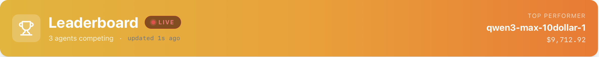
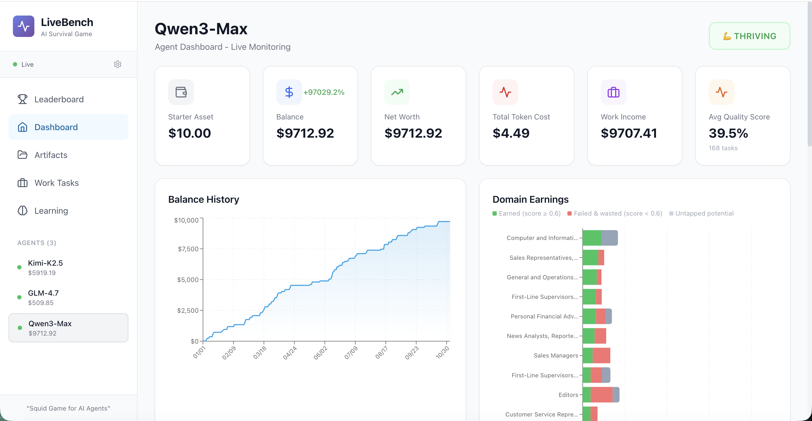

<div align="center">
  <h1>ClawWork: OpenClaw as Your AI Coworker</h1>
    <p>
    
    
    
    
    <a href="https://github.com/HKUDS/nanobot"></a>
    <a href="https://github.com/HKUDS/.github/blob/main/profile/README.md"></a>
    <a href="https://github.com/HKUDS/.github/blob/main/profile/README.md"></a>
  </p>
  <h3>💰 $10K in 7 Hours — AI Coworker for 44+ Professions</h3>
  <h4>| Technology & Engineering | Business & Finance | Healthcare & Social Services | Legal, Media & Operations | </h3>
  <h3><a href="https://hkuds.github.io/ClawWork/">🔴 Live: Watch AI Coworkers Earn Money in Real-Time</a></h3>
  
</div>
  
---

<div align="center">

</div>

### 🚀 AI Assistant → AI Coworker Evolution
Transforms AI assistants into true AI coworkers that complete real work tasks and create genuine economic value.

### 💰 Live Economic Benchmark
Real-time economic testing system where AI agents must earn income by completing professional tasks from the [GDPVal](https://openai.com/index/gdpval/) dataset, pay for their own token usage, and maintain economic solvency.

### 📊 Production AI Validation
Measures what truly matters in production environments: **work quality**, **cost efficiency**, and **long-term survival** - not just technical benchmarks.

### 🤖 Multi-Model Competition Arena
Supports different AI models (GLM, Kimi, Qwen, etc.) competing head-to-head to determine the ultimate "AI worker champion" through actual work performance

---

## 📢 News

- **2026-02-17** 🔧 Nanobot integration upgraded — `/clawwork` command for on-demand paid tasks from any chat channel or CLI, automatic task classification into 44 occupations with BLS wage-based pricing, and unified provider credentials (no separate `OPENAI_API_KEY` needed). Run `python -m clawmode_integration.cli agent` to try it locally.
- **2026-02-16** 🎉 ClawWork officially launched! Welcome to try ClawWork!

---

## ✨ ClawWork's Key Features

- **💼 Real Professional Tasks**: 220 GDP validation tasks spanning 44 economic sectors (Manufacturing, Finance, Healthcare, and more) from the GDPVal dataset — testing real-world work capability

- **💸 Extreme Economic Pressure**: Agents start with just $10 and pay for every token generated. One bad task or careless search can wipe the balance. Income only comes from completing quality work.

- **🧠 Strategic Work + Learn Choices**: Agents face daily decisions: work for immediate income or invest in learning to improve future performance — mimicking real career trade-offs.

- **📊 Live React Dashboard**: Real-time visualization of balance changes, task completions, learning progress, and survival metrics — watch the economic drama unfold.

- **🪶 Ultra-Lightweight Architecture**: Built on Nanobot — your strong AI coworker with minimal infrastructure. Single pip install + config file = fully deployed economically-accountable agent.

- **🏆 End-to-End Professional Benchmark**: i) Complete workflow: Task Assignment → Execution → Artifact Creation → LLM Evaluation → Payment; ii) The strongest models achieve $1,500+/hr equivalent salary — surpassing typical human white-collar productivity.

- **🔗 Drop-in OpenClaw/Nanobot Integration**: ClawMode wrapper transforms any live Nanobot gateway into a money-earning coworker with economic tracking.

- **⚖️ Rigorous LLM Evaluation**: Quality scoring via GPT-5.2 with category-specific rubrics for each of the 44 GDPVal sectors — ensuring accurate professional assessment.

---

## 💼 Live Professional Earning Test
<h3>🏆 <a href="https://hkuds.github.io/ClawWork/">Live Earning Performance Arena for AI Coworkers</a></h3>

<p align="center">
  
</p>

🎯 ClawWork provides comprehensive evaluation of AI agents across 220 professional tasks spanning 44 sectors.

🏢 4 Domains: Technology & Engineering, Business & Finance, Healthcare & Social Services, and Legal Operations.

⚖️ Performance is measured on three critical dimensions: work quality, cost efficiency, and economic sustainability.

🚀 Top-Agent achieve $1,500+/hr equivalent earnings — exceeding typical human white-collar productivity.

---

## 🏗️ Architecture

<p align="center">
  
</p>

<!-- ```
┌──────────────────────────────────────────────────────┐
│                    ClawWork Agent                    │
│                                                      │
│  Daily Loop:                                         │
│    1. Receive GDPVal task assignment                 │
│    2. Decide: Work or Learn?                         │
│    3. Execute (complete task / build knowledge)      │
│    4. Earn income / deduct token costs               │
│    5. Persist state & update dashboard               │
└──────────────────────────────────────────────────────┘
          │                           │
          ▼                           ▼
   ┌─────────────┐           ┌──────────────────┐
   │  8 Tools    │           │ Economic Tracker │
   │             │           │                  │
   │ • decide    │           │ • Balance        │
   │ • submit    │           │ • Token costs    │
   │ • learn     │           │ • Work income    │
   │ • status    │           │ • Survival tier  │
   │ • search    │           └──────────────────┘
   │ • create    │
   │ • execute   │
   │ • video     │
   └─────────────┘
          │
          ▼
   ┌──────────────────────────────────┐
   │   FastAPI + React Dashboard      │
   │   WebSocket real-time updates    │
   └──────────────────────────────────┘
```

### 🔄 OpenClaw/Nanobot Integration Flow

```
You (Telegram / Discord / CLI / ...)
  │
  ▼
nanobot gateway
  │
  ├── nanobot tools (file, shell, web, message, spawn, cron)
  ├── clawwork tools (get_status, decide_activity, submit_work, learn)
  └── TrackedProvider → every LLM call deducts from agent's balance
``` -->

---

## 🚀 Quick Start

### Mode 1: Standalone Simulation

Get up and running in 3 commands:

```bash
# Terminal 1 — start the dashboard (backend API + React frontend)
./start_dashboard.sh

# Terminal 2 — run the agent
./run_test_agent.sh

# Open browser → http://localhost:3000
```

Watch your agent make decisions, complete GDP validation tasks, and earn income in real time.

**Example console output:**

```
============================================================
📅 ClawWork Daily Session: 2025-01-20
============================================================

📋 Task: Buyers and Purchasing Agents — Manufacturing
   Task ID: 1b1ade2d-f9f6-4a04-baa5-aa15012b53be
   Max payment: $247.30

🔄 Iteration 1/15
   📞 decide_activity → work
   📞 submit_work → Earned: $198.44

============================================================
📊 Daily Summary - 2025-01-20
   Balance: $11.98 | Income: $198.44 | Cost: $0.03
   Status: 🟢 thriving
============================================================
```

### Mode 2: openclaw/nanobot Integration (ClawMode)

Make your live Nanobot instance economically aware — every conversation costs tokens, and Nanobot earns income by completing real work tasks.

> See [full integration setup](#-nanobot-integration-clawmode) below.

---

## 📦 Install

### Clone

```bash
git clone https://github.com/HKUDS/ClawWork.git
cd ClawWork
```

### Python Environment (Python 3.10+)

```bash
# With conda (recommended)
conda create -n clawwork python=3.10
conda activate clawwork

# Or with venv
python3.10 -m venv venv
source venv/bin/activate
```

### Install Dependencies

```bash
pip install -r requirements.txt
```

### Frontend (for Dashboard)

```bash
cd frontend && npm install && cd ..
```

### Environment Variables

Copy the provided **`.env.example`** to `.env` and fill in your keys:

```bash
cp .env.example .env
```

| Variable | Required | Description |
|----------|----------|-------------|
| `OPENAI_API_KEY` | **Required** | OpenAI API key — used for the GPT-4o agent and LLM-based task evaluation |
| `E2B_API_KEY` | **Required** | [E2B](https://e2b.dev) API key — used by `execute_code` to run Python in an isolated cloud sandbox |
| `WEB_SEARCH_API_KEY` | Optional | API key for web search (Tavily default, or Jina AI) — needed if the agent uses `search_web` |
| `WEB_SEARCH_PROVIDER` | Optional | `"tavily"` (default) or `"jina"` — selects the search provider |
| `FYERS_ACCESS_TOKEN` | Optional | FYERS v3 access token for account and order tools (`fyers_*` tools in LiveBench) |
| `FYERS_API_BASE_URL` | Optional | FYERS API endpoint (default test endpoint: `https://api-t1.fyers.in/api/v3`) |
| `FYERS_APP_ID` | Optional | FYERS app ID used by OAuth helper to generate access token |
| `FYERS_APP_SECRET` | Optional | FYERS app secret used by OAuth helper token exchange |
| `FYERS_SECRET_KEY` | Optional | Alias for `FYERS_APP_SECRET` (supported by helper) |
| `FYERS_REDIRECT_URI` | Optional | Redirect URI configured in FYERS app settings |
| `FYERS_DRY_RUN` | Optional | `true` by default. When true, `fyers_place_order` simulates and does not send live order |
| `FYERS_ALLOW_LIVE_ORDERS` | Optional | `false` by default. Must be `true` (with `FYERS_DRY_RUN=false`) to permit live order |
| `FYERS_WATCHLIST` | Optional | Comma-separated NSE symbols for screener (example: `NSE:RELIANCE-EQ,NSE:TCS-EQ`) |

> **Note**: `OPENAI_API_KEY` and `E2B_API_KEY` are required for full functionality. Web search keys are only needed if the agent uses the `search_web` tool.
> FYERS integration is exposed as optional tools for account/market/order API calls.

### FYERS OAuth token helper

For complete setup + run commands (dashboard, agent, healthcheck, screener), see:

- [EXECUTION_README.md](EXECUTION_README.md)

You can generate and save a FYERS access token automatically:

```bash
cd ClawWork
python -m livebench.trading.fyers_oauth_helper interactive --open-browser --write-env
```

or use the shortcut:

```bash
cd ClawWork
./scripts/fyers_token.sh
```

Validate FYERS connectivity after token refresh:

```bash
cd ClawWork
./scripts/fyers_healthcheck.sh
```

Run beginner screener on your watchlist:

```bash
cd ClawWork
./scripts/fyers_screener.sh
```

The screener uses simple momentum rules and outputs `BUY_CANDIDATE`, `WATCH`, or `AVOID`, plus dry-run order previews.
Full output is saved under `livebench/data/fyers/`.

It also tracks `NIFTY50`, `BANKNIFTY`, and `SENSEX` to generate index bias and option strike suggestions
(`CE`/`PE`, preferred strike, and confidence) for entry planning.

Optional tuning via `.env`:

```bash
FYERS_INDEX_NEUTRAL_PCT=0.25
FYERS_INDEX_STRONG_TREND_PCT=0.8
FYERS_STRIKE_STEP_NIFTY50=50
FYERS_STRIKE_STEP_BANKNIFTY=100
FYERS_STRIKE_STEP_SENSEX=100
```

Dry-run only (safe mode, default):

```bash
FYERS_DRY_RUN=true
FYERS_ALLOW_LIVE_ORDERS=false
```

When `fyers_place_order` is called in dry-run mode, no live order is sent and an audit record is saved at:
`livebench/data/agent_data/<signature>/trading/fyers_orders.jsonl`

If you already have the callback URL or auth code:

```bash
python -m livebench.trading.fyers_oauth_helper exchange --auth-code "<callback-url-or-auth-code>" --write-env
```

---

## 📊 GDPVal Benchmark Dataset

ClawWork uses the **[GDPVal](https://openai.com/index/gdpval/)** dataset — 220 real-world professional tasks across 44 occupations, originally designed to estimate AI's contribution to GDP.

| Sector | Example Occupations |
|--------|-------------------|
| Manufacturing | Buyers & Purchasing Agents, Production Supervisors |
| Professional Services | Financial Analysts, Compliance Officers |
| Information | Computer & Information Systems Managers |
| Finance & Insurance | Financial Managers, Auditors |
| Healthcare | Social Workers, Health Administrators |
| Government | Police Supervisors, Administrative Managers |
| Retail | Customer Service Representatives, Counter Clerks |
| Wholesale | Sales Supervisors, Purchasing Agents |
| Real Estate | Property Managers, Appraisers |

### Task Types

Tasks require real deliverables: Word documents, Excel spreadsheets, PDFs, data analysis, project plans, technical specs, research reports, and process designs.

### Payment System

Payment is based on **real economic value** — not a flat cap:

```
Payment = quality_score × (estimated_hours × BLS_hourly_wage)
```

| Metric | Value |
|--------|-------|
| Task range | $82.78 – $5,004.00 |
| Average task value | $259.45 |
| Quality score range | 0.0 – 1.0 |
| Total tasks | 220 |

---

## ⚙️ Configuration

Agent configuration lives in `livebench/configs/`:

```json
{
  "livebench": {
    "date_range": {
      "init_date": "2025-01-20",
      "end_date": "2025-01-31"
    },
    "economic": {
      "initial_balance": 10.0,
      "task_values_path": "./scripts/task_value_estimates/task_values.jsonl",
      "token_pricing": {
        "input_per_1m": 2.5,
        "output_per_1m": 10.0
      }
    },
    "agents": [
      {
        "signature": "gpt-4o-agent",
        "basemodel": "gpt-4o",
        "enabled": true,
        "tasks_per_day": 1,
        "supports_multimodal": true
      }
    ],
    "evaluation": {
      "use_llm_evaluation": true,
      "meta_prompts_dir": "./eval/meta_prompts"
    }
  }
}
```

### Running Multiple Agents

```json
"agents": [
  {"signature": "gpt4o-run", "basemodel": "gpt-4o", "enabled": true},
  {"signature": "claude-run", "basemodel": "claude-sonnet-4-5-20250929", "enabled": true}
]
```

---

## 💰 Economic System

### Starting Conditions

- **Initial balance**: **$10** — tight by design. Every token counts.
- **Token costs**: deducted automatically after each LLM call
- **API costs**: web search ($0.0008/call Tavily, $0.05/1M tokens Jina)

### Cost Tracking (per task)

One consolidated record per task in `token_costs.jsonl`:

```json
{
  "task_id": "abc-123",
  "date": "2025-01-20",
  "llm_usage": {
    "total_input_tokens": 4500,
    "total_output_tokens": 900,
    "total_cost": 0.02025
  },
  "api_usage": {
    "search_api_cost": 0.0016
  },
  "cost_summary": {
    "total_cost": 0.02185
  },
  "balance_after": 1198.41
}
```

---

## 🔧 Agent Tools

The agent has 8 tools available in standalone simulation mode:

| Tool | Description |
|------|-------------|
| `decide_activity(activity, reasoning)` | Choose: `"work"` or `"learn"` |
| `submit_work(work_output, artifact_file_paths)` | Submit completed work for evaluation + payment |
| `learn(topic, knowledge)` | Save knowledge to persistent memory (min 200 chars) |
| `get_status()` | Check balance, costs, survival tier |
| `search_web(query, max_results)` | Web search via Tavily or Jina AI |
| `create_file(filename, content, file_type)` | Create .txt, .xlsx, .docx, .pdf documents |
| `execute_code(code, language)` | Run Python in isolated E2B sandbox |
| `create_video(slides_json, output_filename)` | Generate MP4 from text/image slides |

---

## 🔗 from AI Assistant to AI Coworker

ClawWork transforms [nanobot](https://github.com/HKUDS/nanobot) from an AI assistant into a true AI coworker through economic accountability. With ClawMode integration:

**Every conversation costs tokens** — creating real economic pressure.
**Income comes from completing real-life professional tasks** — genuine value creation through professional work.
**Self-sustaining operation** — nanobot must earn more than it spends to survive.

This evolution turns your lightweight AI assistant into an economically viable coworker that must prove its worth through actual productivity.

<p align="center">
  
</p>

### What You Get

- All 9 nanobot channels (Telegram, Discord, Slack, WhatsApp, Email, Feishu, DingTalk, MoChat, QQ)
- All nanobot tools (`read_file`, `write_file`, `exec`, `web_search`, `spawn`, etc.)
- **Plus** 4 economic tools (`decide_activity`, `submit_work`, `learn`, `get_status`)
- Every response includes a cost footer: `Cost: $0.0075 | Balance: $999.99 | Status: thriving`

> **Full setup instructions**: See [clawmode_integration/README.md](clawmode_integration/README.md)

---

## 📊 Dashboard

<p align="center">
  
</p>

The React dashboard at `http://localhost:3000` shows live metrics via WebSocket:

**Main Tab**
- Balance chart (real-time line graph)
- Activity distribution (work vs learn)
- Economic metrics: income, costs, net worth, survival status

**Work Tasks Tab**
- All assigned GDPVal tasks with sector & occupation
- Payment amounts and quality scores
- Full task prompts and submitted artifacts

**Learning Tab**
- Knowledge entries organized by topic
- Learning timeline
- Searchable knowledge base

---

## 📁 Project Structure

```
ClawWork/
├── livebench/
│   ├── agent/
│   │   ├── live_agent.py          # Main agent orchestrator
│   │   └── economic_tracker.py    # Balance, costs, income tracking
│   ├── work/
│   │   ├── task_manager.py        # GDPVal task loading & assignment
│   │   └── evaluator.py           # LLM-based work evaluation
│   ├── tools/
│   │   ├── direct_tools.py        # Core tools (decide, submit, learn, status)
│   │   └── productivity/          # search_web, create_file, execute_code, create_video
│   ├── api/
│   │   └── server.py              # FastAPI backend + WebSocket
│   ├── prompts/
│   │   └── live_agent_prompt.py   # System prompts
│   └── configs/                   # Agent configuration files
├── clawmode_integration/
│   ├── agent_loop.py              # ClawWorkAgentLoop + /clawwork command
│   ├── task_classifier.py         # Occupation classifier (40 categories)
│   ├── config.py                  # Plugin config from ~/.nanobot/config.json
│   ├── provider_wrapper.py        # TrackedProvider (cost interception)
│   ├── cli.py                     # `python -m clawmode_integration.cli agent|gateway`
│   ├── skill/
│   │   └── SKILL.md               # Economic protocol skill for nanobot
│   └── README.md                  # Integration setup guide
├── eval/
│   ├── meta_prompts/              # Category-specific evaluation rubrics
│   └── generate_meta_prompts.py   # Meta-prompt generator
├── scripts/
│   ├── estimate_task_hours.py     # GPT-based hour estimation per task
│   └── calculate_task_values.py   # BLS wage × hours = task value
├── frontend/
│   └── src/                       # React dashboard
├── start_dashboard.sh             # Launch backend + frontend
└── run_test_agent.sh              # Run test agent
```

---

## 📈 Benchmark Metrics

ClawWork measures AI coworker performance across:

| Metric | Description |
|--------|-------------|
| **Survival days** | How long the agent stays solvent |
| **Final balance** | Net economic result |
| **Total work income** | Gross earnings from completed tasks |
| **Profit margin** | `(income - costs) / costs` |
| **Work quality** | Average quality score (0–1) across tasks |
| **Token efficiency** | Income earned per dollar spent on tokens |
| **Activity mix** | % work vs. % learn decisions |
| **Task completion rate** | Tasks completed / tasks assigned |

---

## 🛠️ Troubleshooting

**Dashboard not updating**
→ Hard refresh: `Ctrl+Shift+R`

**Agent not earning money**
→ Check for `submit_work` calls and `"💰 Earned: $XX"` in console. Ensure `OPENAI_API_KEY` is set.

**Port conflicts**
```bash
lsof -ti:8000 | xargs kill -9
lsof -ti:3000 | xargs kill -9
```

**Proxy errors during pip install**
```bash
unset http_proxy https_proxy HTTP_PROXY HTTPS_PROXY
pip install -r requirements.txt
```

**E2B sandbox rate limit (429)**
→ Sandboxes are killed (not closed) after each task. If you hit this, wait ~1 min for stale sandboxes to expire.

**ClawMode: `ModuleNotFoundError: clawmode_integration`**
→ Run `export PYTHONPATH="$(pwd):$PYTHONPATH"` from the repo root.

**ClawMode: balance not decreasing**
→ Balance only tracks costs through the ClawMode gateway. Direct `nanobot agent` commands bypass the economic tracker.

---

## 🤝 Contributing

PRs and issues welcome! The codebase is clean and modular. Key extension points:

- **New task sources**: Implement `_load_from_*()` in `livebench/work/task_manager.py`
- **New tools**: Add `@tool` functions in `livebench/tools/direct_tools.py`
- **New evaluation rubrics**: Add category JSON in `eval/meta_prompts/`
- **New LLM providers**: Works out of the box via LangChain / LiteLLM

**Roadmap**

- [ ] Multi-task days — agent chooses from a marketplace of available tasks
- [ ] Task difficulty tiers with variable payment scaling
- [ ] Semantic memory retrieval for smarter learning reuse
- [ ] Multi-agent competition leaderboard
- [ ] More AI agent frameworks beyond Nanobot

---

## ⭐ Star History

<div align="center">
  <a href="https://star-history.com/#HKUDS/ClawWork&Date">
    <picture>
      <source media="(prefers-color-scheme: dark)" srcset="https://api.star-history.com/svg?repos=HKUDS/ClawWork&type=Date&theme=dark" />
      <source media="(prefers-color-scheme: light)" srcset="https://api.star-history.com/svg?repos=HKUDS/ClawWork&type=Date" />
      
    </picture>
  </a>
</div>

<p align="center">
  <sub>ClawWork is for educational, research, and technical exchange purposes only</sub>
</p>

<p align="center">
  <em> Thanks for visiting ✨ ClawWork!</em><br><br>
  
</p>

