# Scalping Engine Workflow

This document describes the current scalping engine behavior after the live-paper, replay, diagnostics, and hardening updates.

Primary implementation references:

- [engine.py](/Users/bhoomidakshpc/Project_WebSocket/ClawWork_FyersN7/engines/scalping/scalping/engine.py)
- [api.py](/Users/bhoomidakshpc/Project_WebSocket/ClawWork_FyersN7/engines/scalping/scalping/api.py)
- [config.py](/Users/bhoomidakshpc/Project_WebSocket/ClawWork_FyersN7/engines/scalping/scalping/config.py)
- [data_agents.py](/Users/bhoomidakshpc/Project_WebSocket/ClawWork_FyersN7/engines/scalping/scalping/agents/data_agents.py)
- [analysis_agents.py](/Users/bhoomidakshpc/Project_WebSocket/ClawWork_FyersN7/engines/scalping/scalping/agents/analysis_agents.py)
- [volatility_surface_agent.py](/Users/bhoomidakshpc/Project_WebSocket/ClawWork_FyersN7/engines/scalping/scalping/agents/volatility_surface_agent.py)
- [dealer_pressure_agent.py](/Users/bhoomidakshpc/Project_WebSocket/ClawWork_FyersN7/engines/scalping/scalping/agents/dealer_pressure_agent.py)
- [execution_microstructure.py](/Users/bhoomidakshpc/Project_WebSocket/ClawWork_FyersN7/engines/scalping/scalping/execution_microstructure.py)
- [signal_quality_agent.py](/Users/bhoomidakshpc/Project_WebSocket/ClawWork_FyersN7/engines/scalping/scalping/agents/signal_quality_agent.py)
- [infrastructure_agents.py](/Users/bhoomidakshpc/Project_WebSocket/ClawWork_FyersN7/engines/scalping/scalping/agents/infrastructure_agents.py)
- [meta_agents.py](/Users/bhoomidakshpc/Project_WebSocket/ClawWork_FyersN7/engines/scalping/scalping/agents/meta_agents.py)
- [execution_agents.py](/Users/bhoomidakshpc/Project_WebSocket/ClawWork_FyersN7/engines/scalping/scalping/agents/execution_agents.py)
- [context_guard.py](/Users/bhoomidakshpc/Project_WebSocket/ClawWork_FyersN7/engines/scalping/scalping/context_guard.py)

## 1. Engine Modes

```text
if replay job active:
    mode = REPLAY
elif market hours active:
    if LIVE_REAL explicitly enabled:
        mode = LIVE_REAL
    else:
        mode = LIVE_PAPER
else:
    mode = IDLE
```

Default behavior:

- market closed -> `IDLE`
- market open -> `LIVE_PAPER`
- `LIVE_REAL` stays disabled unless explicitly enabled by config / env

## 2. Data Inputs Per Cycle

### Spot data

Fetched into `context.data["spot_data"]`:

- LTP
- open
- high
- low
- prev close
- volume
- VWAP
- change %
- timestamp

### Option chain data

Fetched into `context.data["option_chains"]`:

- strike
- option type
- LTP
- bid
- ask
- spread
- spread %
- bid qty
- ask qty
- volume
- OI
- OI change
- Greeks
- top 5 bid depth levels
- top 5 ask depth levels
- order book imbalance
- order book pressure

### Futures data

Fetched into:

- `context.data["futures_data"]`
- `context.data["futures_momentum"]`

Includes:

- futures LTP
- basis
- basis %
- timestamp
- short-term price-change based momentum

### Candle reconstruction

Built into:

- `context.data["candles_1m"]`
- `context.data[f"candles_{symbol}"]`

Each candle has:

- open
- high
- low
- close
- timestamp

These candles feed structure and trailing-stop logic.

## 3. Data Source Priority

### Live paper mode

For live cycles the fetch order is:

1. shared market adapter
2. legacy FYERS path
3. sample fallback

### Replay mode

Replay uses:

1. CSV replay adapter
2. market simulator
3. same normalized context structure as live mode

Replay emits the same event types:

- `market_tick`
- `option_update`
- `futures_update`

## 4. Fallback Trading Protection

Synthetic fallback data is now execution-safe.

If any live cycle uses sample fallback data:

- `context.data["synthetic_fallback_used"] = True`
- `context.data["trade_disabled"] = True`
- `context.data["trade_disabled_reason"] = "synthetic_fallback_data"`

That means:

- the cycle may still render data to the dashboard
- execution is skipped
- no simulated paper trade is allowed on synthetic live fallback

## 5. Lag / Freshness / Heartbeat Protection

### Engine cadence

- live paper cadence: usually `5s`
- replay cadence: `200ms`
- micro execution cadence: `execution_loop_interval_ms`, currently `300ms` by default

### LatencyGuardian

Live mode only.

Freshness thresholds are now scalping-grade:

- spot stale threshold: `5s`
- option stale threshold: `5s`
- futures stale threshold: `5s`
- tick heartbeat threshold: `5s`

Additional checks:

- warning if API latency > `500ms`
- critical if API latency > `2000ms`
- block trading if even one required source goes stale
- block trading if no new tick heartbeat arrives within threshold

Replay mode:

- LatencyGuardian is skipped

## 6. Context Integrity Guard

Before analysis, risk, and execution, the engine validates shared context shape.

Checks include:

- `spot_data` exists and has LTP / OHLC
- `option_chains` exists and contains option rows
- `futures_data` exists and has valid LTP
- `positions` is a list before execution

If a critical context issue is found:

- the phase is blocked
- a warning is logged
- the kill switch may be triggered

## 7. Core Strategy Pipeline

This engine is not a single-indicator system. It is a gated, multi-stage pipeline.

### Phase 0: Kill switch

Runs first every cycle.

Can halt the entire pipeline on:

- latency spike
- volatility shock
- rapid drawdown
- API health failure cluster
- daily loss breach
- loss cluster
- manual/context safety trigger

### Phase 1: Data

Runs:

- `DataFeedAgent`
- `OptionChainAgent`
- `FuturesAgent`
- `LatencyGuardianAgent` in live mode only

If spot data is missing:

- cycle stops before analysis

If latency / heartbeat checks fail:

- cycle stops before analysis

### Phase 2-4: Analysis

Runs:

- `MarketRegimeAgent`
- `StructureAgent`
- `MomentumAgent`
- `TrapDetectorAgent`
- `VolatilitySurfaceAgent`
- `DealerPressureAgent`
- `StrikeSelectorAgent`
- `SignalQualityAgent`

#### Structure logic

Uses:

- swing highs / lows
- break of structure
- market structure shift
- VWAP bias

#### Momentum logic

Uses:

- futures surge
- volume spike
- option expansion
- gamma behavior

#### Trap logic

Uses:

- liquidity sweep
- OI trap
- PCR spike
- bid/ask imbalance

#### Strike selection logic

Filters by:

- direction from structure / momentum
- OTM distance
- premium range
- delta range
- spread %
- volume
- OI

OTM distance is now dynamic:

- high IV percentile / high vol surface score -> closer OTM strikes
- low IV percentile / softer vol surface -> farther OTM strikes

#### Volatility surface logic

Computes:

- `surface_score`
- `iv_percentile`
- `realized_vol`
- `term_structure_slope`
- `otm_scale`
- `size_scale`
- `target_scale`

Uses:

- VIX
- option IV history
- short-window realized volatility
- near vs next expiry IV slope when expiry data exists

#### Dealer pressure logic

Computes:

- `gamma_regime`
- `gamma_flip_level`
- `pinning_score`
- `acceleration_score`

Uses:

- OI by strike
- gamma concentration
- spot proximity to large OI / gamma strikes

#### Signal quality logic

Scores using:

- confidence
- regime alignment
- volume quality
- liquidity quality
- momentum alignment
- risk/reward
- volatility surface state
- dealer pressure state

The quality weights can now adjust from recent learning feedback.

## 8. Execution Gating

Base execution path is:

```text
strike_selections
  -> quality_filtered_signals
  -> liquidity_filtered_selections
  -> execution_candidates_snapshot
  -> pre-entry confirmation / vacuum / queue / burst checks
  -> execution_candidates
  -> EntryAgent
```

Raw strike selections do not go directly to execution.

The micro execution layer does not recompute analysis. It only confirms or cancels already-approved candidates.

### Liquidity gate

LiquidityMonitor checks:

- spread %
- bid depth
- ask depth
- volume
- OI

Rejected signals append reasons into:

- `context.data["rejected_signals"]`

### Correlation gate

CorrelationGuard now blocks:

- pending orders that would add same-direction correlated exposure
- candidate signals that would create clustered same-direction positions
- same-expiry same-direction clusters when expiry is available

### Micro execution gate

The fast execution loop reads:

- `context.data["execution_candidates_snapshot"]`
- latest option-chain spread / depth / imbalance
- existing risk / correlation state

It computes and stores:

- `context.data["entry_confirmation_state"]`
- `context.data["liquidity_vacuum"]`
- `context.data["momentum_strength"]`
- `context.data["queue_risk"]`
- `context.data["volatility_burst"]`

It checks:

- snapshot is still fresh
- order-book imbalance still supports direction
- spread has not widened beyond micro threshold
- price has not reversed inside the confirmation window
- entry conditions still hold
- risk and correlation state still allow execution

It applies timing rules:

- strong momentum -> immediate confirmation
- medium momentum -> `300-700ms` confirmation window
- weak momentum -> reject signal

It applies market microstructure rules:

- liquidity vacuum detection from sudden top-5 depth collapse
- queue-position risk estimation from visible ask depth ahead
- short-window volatility burst detection from tick returns + spread jump

It writes:

- `context.data["execution_candidates"]`
- `context.data["micro_execution_state"]`
- `context.data["micro_rejections"]`

### Risk gate

RiskGuardian now checks:

- daily loss limit
- risk per trade
- spread environment
- trading hours
- no-trade zones
- max positions
- max exposure per symbol
- consecutive loss pause

Risk breaches can set:

- `trade_disabled`
- `trade_disabled_reason`
- snapshot execution can also be cancelled if risk state changes before entry

## 9. Entry Logic

EntryAgent now prefers `execution_candidates` from the micro execution loop.

Fallback behavior:

- if micro loop has not confirmed anything yet, it falls back to `liquidity_filtered_selections`

A trade candidate must satisfy at least 2 conditions from:

- structure break
- futures momentum
- volume burst
- trap confirmed or trap alignment

If fewer than 2 conditions are true:

- signal is rejected

Additional execution-intelligence checks:

- if adaptive timing says momentum is weak -> reject
- if confirmation state is not `confirmed` for a micro-confirmed candidate -> reject
- if queue risk is too high -> reject
- if queue risk is medium -> reduce order lots
- if liquidity vacuum is active -> small bounded boost to multiplier
- if volatility burst is active -> pass tighter stop metadata into the position manager

### Confidence-weighted sizing

Position multiplier starts from confidence and is reduced by:

- higher spread
- higher VIX
- weak learned probability
- volatility surface `size_scale`
- dealer long-gamma penalty near pinning regimes

If multiplier `< 0.2`:

- signal is rejected

Dealer short-gamma acceleration can provide a small bounded size boost.

Queue-position logic can further reduce effective lots after multiplier calculation.

## 10. Fill Validation Layer

After a trade candidate reaches execution, the engine validates fill quality before simulating the order.

Checks include:

- max slippage %
- bid/ask drift %
- spread widening ratio during entry

If any of these fail:

- order is not created
- rejection reason is stored

This protects paper results from unrealistic fills during unstable quotes.

## 11. Simulated Paper Execution

In `LIVE_PAPER` and `REPLAY`:

- broker calls are disabled
- fills are simulated from market quotes
- positions, trades, and capital are updated exactly as dashboard state

Synced state:

- `context.data["positions"]`
- `context.data["executed_trades"]`
- `context.data["capital_state"]`

This is then mirrored into `ScalpingState` for the UI.

## 12. Exit Logic

ExitAgent now has visible, explicit exit controls:

- partial exit at first target
- runner stop
- runner target
- time stop
- momentum reversal exit
- spread widening exit
- profit lock
- trailing stop

Trailing methods still support:

- candle high/low
- VWAP
- ATR style trailing

Target handling is now volatility-aware:

- `target_scale` from volatility surface can widen or tighten target distance

Burst-aware stop handling:

- `stop_scale` from micro volatility burst tightens the initial stop for faster markets

## 13. Engine Health Watchdog

If a cycle takes longer than the loop cadence:

- a watchdog warning is logged
- the next execution stage is skipped

Purpose:

- prevent backlog-driven stale execution
- avoid a slow cycle immediately placing trades on delayed context

## 14. Learning Feedback Loop

Trade records now persist additional execution context:

- regime
- entry conditions triggered
- entry condition count
- spread %
- momentum strength
- outcome

This is summarized into:

- `context.data["learning_feedback"]`

SignalQuality reads those summaries and can adapt scoring weights slightly based on recent winners vs losers.

This does not replace the strategy. It reweights the quality gate around recent trade outcomes.

## 15. Order Book Depth and Liquidity Pressure

The option chain now includes top 5 depth on both sides for each option:

- `top_bid_levels`
- `top_ask_levels`

And derived signals:

- `order_book_imbalance`
- `order_book_pressure`

Imbalance is computed from top-5 bid quantity vs top-5 ask quantity.

Pressure is summarized as:

- `BUY`
- `SELL`
- `neutral`

This allows the engine to reason about liquidity pressure, not just LTP or single-level bid/ask.

## 16. Micro Execution Loop

The engine now has two loops:

- analysis loop: `5s`
- micro execution loop: `300ms` default

The micro loop:

- does not rebuild structure or quality
- reads the latest published snapshot
- confirms or cancels candidates between main cycles
- can run a lightweight execution pass under the engine lock so the same snapshot is not executed twice

Per candidate, it now evaluates:

- pre-entry confirmation window
- liquidity vacuum
- adaptive momentum timing
- queue-position risk
- volatility burst mode

This allows faster execution timing without rerunning the full pipeline.

## 17. Mermaid Flowchart

```mermaid
flowchart TD
    A[Cycle Start] --> B{Replay Active?}
    B -->|Yes| C[Mode = REPLAY]
    B -->|No| D{Market Hours?}
    D -->|No| E[Mode = IDLE]
    D -->|Yes| F[Mode = LIVE_PAPER by default]
    E --> Z[Stop]

    C --> G[Replay Adapter + Market Simulator]
    F --> H[Live Data Adapters]

    G --> I[Kill Switch]
    H --> I

    I -->|Blocked| Z1[Halt Trading]
    I -->|Pass| J[Fetch Spot / Options / Futures]

    J --> K{Any Live Sample Fallback Used?}
    K -->|Yes| K1[trade_disabled = True]
    K -->|No| L[Continue]
    K1 --> L

    L --> M{Spot Data Present?}
    M -->|No| Z2[Skip Cycle]
    M -->|Yes| N[Build 1m Candles + Tick Heartbeat]

    N --> O{Replay Mode?}
    O -->|Yes| P[Skip LatencyGuardian]
    O -->|No| Q[LatencyGuardian]

    Q --> R{Stale or Heartbeat Dead?}
    R -->|Yes| Z3[Skip Cycle]
    R -->|No| S[Context Guard: Analysis]
    P --> S

    S --> T[MarketRegime]
    T --> U[Structure]
    T --> V[Momentum]
    T --> W[TrapDetector]

    U --> X[VolatilitySurface]
    V --> X
    W --> X
    X --> X1[DealerPressure]
    X1 --> X2[StrikeSelector]

    X2 --> Y[SignalQuality]
    Y --> Y1{Pass Quality?}
    Y1 -->|No| Z4[Reject Signal]
    Y1 -->|Yes| AA[LiquidityMonitor]

    AA --> AB{Liquid?}
    AB -->|No| Z5[Reject for Liquidity]
    AB -->|Yes| AC[RiskGuardian]

    AC --> AD{Risk / Exposure / Loss Pause OK?}
    AD -->|No| Z6[Disable Trading]
    AD -->|Yes| AE[CorrelationGuard]

    AE --> AF{Clustered / Correlated?}
    AF -->|Yes| Z7[Block Signal or Order]
    AF -->|No| AG[Publish Execution Snapshot]

    AG --> AH[Micro Execution Loop]
    AH --> AH1[Adaptive Momentum Timing]
    AH1 --> AH2{Strong / Medium / Weak?}
    AH2 -->|Weak| Z8[Cancel Candidate]
    AH2 -->|Strong| AJ[execution_candidates]
    AH2 -->|Medium| AH3[Pre-Entry Confirmation Window]
    AH3 --> AH4{Imbalance + Spread + Price Hold?}
    AH4 -->|No| Z8
    AH4 -->|Yes| AH5[Liquidity Vacuum + Queue Risk + Volatility Burst]
    AH5 --> AH6{Queue Risk Acceptable?}
    AH6 -->|No| Z8
    AH6 -->|Yes| AJ[execution_candidates]

    AJ --> AK{Watchdog Skip Active?}
    AK -->|Yes| Z9[Skip Execution]
    AK -->|No| AL[EntryAgent]

    AL --> AM{>= 2 Entry Conditions?}
    AM -->|No| Z10[Reject Signal]
    AM -->|Yes| AN[Fill Validation]

    AN --> AO{Slippage / Drift / Spread OK?}
    AO -->|No| Z11[Reject Signal]
    AO -->|Yes| AP[Compute Multiplier]

    AP --> AQ{Multiplier >= 0.2 and Queue Risk OK?}
    AQ -->|No| Z12[Reject Signal]
    AQ -->|Yes| AR[Create Simulated Order]

    AR --> AS[ExitAgent]
    AS --> AT[PositionManager]
    AT --> AU[Build Capital State + Learning Feedback]
    AU --> AV[Sync ScalpingState]
    AV --> AW[Dashboard]
```



## 18. Plain If/Else Decision Map

```text
if replay_active:
    use replay payload
elif market_open:
    use live adapters
else:
    idle

run kill switch
if kill switch active:
    halt

fetch spot, option chain, futures
if live data fell back to synthetic sample:
    disable trading for the cycle

if spot missing:
    skip cycle

build candles and heartbeat

if live mode and data stale or no tick heartbeat:
    skip cycle

validate context
run regime, structure, momentum, trap
run volatility surface
run dealer pressure
run strike selector

if no strike passes:
    no candidate

run quality gate
if rejected:
    store rejection reason

run liquidity gate
if rejected:
    store rejection reason

run risk gate
if breached:
    disable trading

run correlation guard
if clustered:
    block signal or order

publish execution snapshot

run micro execution loop
compute adaptive momentum timing
if weak momentum:
    cancel candidate

if medium momentum:
    open 300-700ms confirmation window
    if imbalance/spread/price fail during window:
        cancel candidate

detect liquidity vacuum
estimate queue risk
detect volatility burst

if queue risk too high:
    cancel candidate

if candidate still valid:
    mark execution candidate

if watchdog says previous cycle overran:
    skip execution stage

run entry gate
if fewer than 2 conditions:
    reject

validate fill quality
if slippage/drift/spread invalid:
    reject

compute position multiplier
apply queue-based lot reduction
if multiplier < 0.2:
    reject

simulate order
manage exits
update positions/trades/capital
store learning feedback
sync dashboard
```

## 19. Main Failure Points

Signals usually die at one of these points:

1. missing spot data
2. stale live data
3. no tick heartbeat
4. synthetic fallback disabled execution
5. no valid strike after OTM / premium / delta / spread / volume / OI filters
6. quality filter rejection
7. liquidity rejection
8. risk / exposure / consecutive-loss pause
9. correlation / cluster block
10. insufficient entry conditions
11. fill slippage / bid-ask drift / spread widening
12. queue-position risk too high
13. multiplier too low
14. micro loop cancels candidate before execution
15. watchdog skip after slow cycle

## 20. Final System View

```text
React Dashboard
  -> FastAPI / Uvicorn
  -> Embedded Scalping Engine
  -> Shared BotContext
  -> 5s Analysis Pipeline
  -> 300ms Micro Execution Loop with Confirmation / Vacuum / Queue / Burst Checks
  -> Positions / Trades / Capital / Diagnostics
  -> ScalpingState
  -> Dashboard widgets
```
